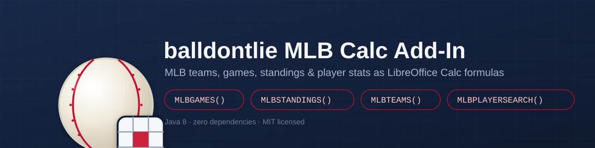

<p align="center">
  
</p>

# balldontlie MLB Calc Add-In

[](https://github.com/davidjayjackson/balldontlie_mlb/releases/latest)

A LibreOffice Calc add-in (UNO component, **Java**, MIT licensed) exposing
MLB teams, players, games, standings, and player statistics from the
[balldontlie](https://www.balldontlie.io/) API as worksheet functions.

> New here? [docs/TUTORIAL.md](docs/TUTORIAL.md) is a step-by-step
> walkthrough — install, configure your API key, and build a working
> team + player dashboard. This README is the function reference.

| Function | Signature | Returns |
|----------|-----------|---------|
| `MLBTEAMS`        | `MLBTEAMS([league]; [division]; [api_key])`              | spillable array: id, abbreviation, display_name, location, league, division |
| `MLBTEAM`          | `MLBTEAM(team_id; field; [api_key])`                     | one field's value, by team id |
| `MLBPLAYERSEARCH` | `MLBPLAYERSEARCH(search_text; [max_rows]; [api_key])`    | spillable array: id, full_name, position, team, active |
| `MLBPLAYER`        | `MLBPLAYER(player_id; field; [api_key])`                 | one field's value, by player id |
| `MLBGAMES`        | `MLBGAMES(date_or_season; [team_id]; [max_rows]; [api_key])` | spillable array: id, date, away_team_name, away_runs, home_team_name, home_runs, status, season_type |
| `MLBGAME`          | `MLBGAME(game_id; field; [api_key])`                     | one field's value, by game id |
| `MLBSTANDINGS`    | `MLBSTANDINGS(season; [api_key])`                        | spillable array: team, league, division, wins, losses, win_percent, games_behind, run_differential *(paid tier)* |
| `MLBSEASONSTATS`  | `MLBSEASONSTATS(player_id; season; field; [api_key])`    | one season-stat field's value *(paid tier)* |
| `MLBSTAT`          | `MLBSTAT(player_id; game_id; field; [api_key])`          | one field from a single-game stat line *(paid tier)* |
| `MLBLASTERROR`    | `MLBLASTERROR()`                                          | most recent fetch error message (diagnostics) |
| `MLBCACHECLEAR`   | `MLBCACHECLEAR()`                                          | clears the cache; returns the count cleared |

> In Calc's UI, arguments are separated by **semicolons**:
> `=MLBTEAM(147; "abbreviation")`.
>
> Every data function takes a trailing optional **`api_key`** — supply it to
> override the environment for that one call, typed literally or (recommended,
> so the key isn't visible in every formula) as a cell reference:
> `=MLBTEAM(147; "abbreviation"; $B$1)`.

---

## Scalar functions take a `field` argument, by design

Unlike a fixed set of named lookups, `MLBTEAM`, `MLBPLAYER`, `MLBGAME`,
`MLBSEASONSTATS`, and `MLBSTAT` take the **exact balldontlie JSON key** you
want as a string argument — see the field-name reference below. Nested
fields use dot notation: `=MLBGAME(746829; "home_team_data.runs")` or
`=MLBPLAYER(1; "team.abbreviation")`.

## Field-name reference (use these exact JSON keys)

| Type | Fields |
|------|--------|
| `MLBTeam` | `id`, `slug`, `abbreviation`, `display_name`, `short_display_name`, `name`, `location`, `league`, `division` |
| `MLBPlayer` | `id`, `first_name`, `last_name`, `full_name`, `position`, `jersey`, `bats_throws`, `dob`, `age`, `height`, `weight`, `college`, `draft`, `active`, `birth_place`, `team.*` |
| `MLBGame` | `id`, `date`, `season`, `season_type`, `postseason`, `home_team_name`, `away_team_name`, `status`, `venue`, `attendance`, `home_team_data.runs`/`.hits`/`.errors`/`.inning_scores`, `away_team_data.*` |
| `MLBStandings` (`MLBSTANDINGS` columns) | `team`, `league_name`, `division_name`, `wins`, `losses`, `win_percent`, `games_behind`, `run_differential` (also available but not in the default columns: `runs_scored`, `runs_allowed`, `streak`, `last_ten_games`) |
| `MLBSeasonStats` | `batting_*` (`batting_avg`, `batting_hr`, `batting_rbi`, `batting_ops`, `batting_obp`, `batting_slg`, `batting_war`, ...); `pitching_*` (`pitching_era`, `pitching_whip`, `pitching_k`, `pitching_w`, `pitching_l`, `pitching_sv`, `pitching_ip`, `pitching_war`, ...); `fielding_*` (`fielding_fp`, `fielding_e`, ...) |

## Cell functions never block, and never throw

Every function above resolves against a shared cache and returns
**immediately** — none of them ever block on network I/O or raise an
exception. Instead, a cell may show one of:

| Value | Meaning |
|-------|---------|
| `#FETCHING` | First request for this data. A background fetch just started. Recalculate (**F9** or **Ctrl+Shift+F9**) once it completes — usually a second or two. |
| `#NO_API_KEY` | No balldontlie API key could be resolved (see below). |
| `#NOT_FOUND` | The request reached the API, but nothing matched (unknown id, empty search, field name not present on the record, etc). |
| `#TIER` | The endpoint (`MLBSTANDINGS`, `MLBSEASONSTATS`, `MLBSTAT`) requires a balldontlie plan above the free tier. |
| `#RATE_LIMIT` | The free tier's ~5 requests/minute limit was hit. The add-in does not retry-storm on a 429 — it fails that one fetch immediately and retries automatically on a later recalculation, once the cache's error cooldown elapses. |
| `#ERR` | The fetch failed persistently (network error, bad response). Call `MLBLASTERROR()` for the detail message. |

Responses are cached with a TTL appropriate to how often the underlying data
changes, and refreshed silently in the background once stale (you keep
seeing the last-known-good value while the refresh runs):

| Data | TTL |
|------|-----|
| Teams | 24 hours |
| Players | 6 hours |
| Games | 5 minutes |
| Standings | 1 hour |
| Season stats | 1 hour |
| Single-game stats | 5 minutes |

The cache is a bounded, thread-safe (`ConcurrentHashMap`-backed) in-memory
store (up to 1000 entries, oldest evicted first) that lives for the life of
the LibreOffice session — call `MLBCACHECLEAR()` to force fresh data, or
restart LibreOffice.

## Provide the balldontlie API key (never hardcoded)

Get a free key at <https://www.balldontlie.io/>. The key is resolved, in
this priority order:

1. **The `api_key` function argument** — the optional trailing argument of
   every data function. Type it literally, or (recommended, so the key isn't
   spelled out in every formula) reference a cell:
   `=MLBTEAM(147; "abbreviation"; $B$1)`. Wins when supplied, overriding
   everything below for that one call.
2. **Java system property** `balldontlie.api.key` — pass
   `-Dballdontlie.api.key=...` when launching `soffice`.
3. **Environment variable** `BALLDONTLIE_API_KEY` — set it, then launch
   `soffice` from that same shell (or set it persistently and restart
   LibreOffice).
4. **Properties file** at `~/.config/libreoffice-mlb/balldontlie.properties`
   (macOS: `~/Library/Application Support/libreoffice-mlb/balldontlie.properties`):
   ```properties
   api.key=your_key_here
   ```
   This is the most convenient option since it doesn't depend on how
   LibreOffice was launched.

If none of the four resolve, every data function returns `#NO_API_KEY`
instead of failing silently or throwing. Different keys are cached
independently (the cache key includes a fingerprint of the resolved key), so
switching keys — e.g. via the argument — doesn't reuse another key's cached
data or cached error state.

```bash
# Linux/macOS, environment variable route:
export BALLDONTLIE_API_KEY='your_key'
"$LO_HOME/program/soffice"

# or the properties-file route (works regardless of launch method):
mkdir -p ~/.config/libreoffice-mlb
echo 'api.key=your_key' > ~/.config/libreoffice-mlb/balldontlie.properties
```

## Rate limits and tiers

The free tier is tight — around **5 requests/minute**. The add-in throttles
its own outgoing requests to match (minimum ~13s apart, across a 2-thread
background pool) and retries HTTP 5xx responses with bounded exponential
backoff (honoring a numeric `Retry-After` header). A 429 is *not* retried
inline — it fails that fetch immediately with `#RATE_LIMIT`, so one
rate-limited call never snowballs into a burst of retries; the cache's
~15s error cooldown paces the next attempt automatically.

On the free tier, only `/mlb/v1/teams`, `/mlb/v1/players`, and
`/mlb/v1/games` are available — `MLBTEAMS`, `MLBTEAM`, `MLBPLAYERSEARCH`,
`MLBPLAYER`, `MLBGAMES`, and `MLBGAME` all work. `MLBSTANDINGS`,
`MLBSEASONSTATS`, and `MLBSTAT` call paid-tier endpoints (`/standings`,
`/season_stats`, `/stats`); on a free-tier key they return `#TIER` instead of
`#ERR`, so the add-in degrades gracefully rather than looking broken.

## Install (prebuilt)

Download `MLB.oxt` from the [latest release](https://github.com/davidjayjackson/balldontlie_mlb/releases/latest)
(currently [v1.1.0](https://github.com/davidjayjackson/balldontlie_mlb/releases/tag/v1.1.0),
[direct link](https://github.com/davidjayjackson/balldontlie_mlb/releases/latest/download/MLB.oxt))
and install it — no build required:

```bash
mkdir -p ~/.config/libreoffice-mlb
echo 'api.key=your_key' > ~/.config/libreoffice-mlb/balldontlie.properties   # never hardcoded
"$LO_HOME/program/unopkg" add MLB.oxt
```

See "Provide the balldontlie API key" above for the other resolution
mechanisms. Skip to [Try it](#try-it) below.

## Build the .oxt

```bash
export JAVA_HOME=~/opt/jdk8               # any JDK 8+; see docs/INSTALL.md
export LO_HOME=/usr/lib64/libreoffice     # LibreOffice + SDK
./build.sh
# or pass paths explicitly:
./build.sh --jdk ~/opt/jdk8 --libreoffice /usr/lib64/libreoffice
```

This runs `unoidl-write` → `javamaker` → `javac --release 8` → `jar` → zip,
producing **`build/MLB.oxt`**. See [docs/INSTALL.md](docs/INSTALL.md) for
full prerequisites (JDK 8, LibreOffice + SDK, the Java-vendor allow-list fix)
and platform-specific build/install steps.

## Install

```bash
"$LO_HOME/program/unopkg" add --force build/MLB.oxt
```

Or double-click `build/MLB.oxt` to open the Extension Manager. Restart
LibreOffice afterwards (from a shell with the API key set, if you're using
the environment-variable route).

## Try it

```
=MLBTEAMS()                                    -> spills id/abbreviation/display_name/... rows (array formula)
=MLBTEAMS("American"; "East")                  -> spills just the AL East teams (array formula)
=MLBTEAM(147; "abbreviation")                  -> e.g. "NYY"
=MLBPLAYERSEARCH("Judge")                      -> spills matching players (array formula)
=MLBPLAYER(1; "full_name")                     -> player's full name
=MLBPLAYER(1; "team.abbreviation")             -> nested field via dot notation
=MLBGAMES("2024-06-01")                        -> spills that day's games (array formula)
=MLBGAMES("2024"; 147)                         -> spills the Yankees' 2024 season games (array formula)
=MLBGAME(746829; "status")                     -> e.g. "Final"
=MLBGAME(746829; "home_team_data.runs")        -> nested field via dot notation
=MLBSTANDINGS("2024")                          -> spills standings (array formula, paid tier)
=MLBSEASONSTATS(1; "2024"; "batting_avg")      -> season batting average (paid tier)
=MLBSTAT(1; 746829; "hits")                    -> hits in that single game (paid tier)
=MLBLASTERROR()                                -> "" (or the last failure's detail)
=MLBCACHECLEAR()                               -> number of entries cleared
=MLBTEAM(147; "abbreviation"; $B$1)            -> key taken from cell B1 instead of the environment
```

## Behavior notes

- **Multi-cell / spilling.** LibreOffice has no dynamic spill: to see every
  row of a table-returning function, select the output range and enter it as
  an **array formula** (Ctrl+Shift+Enter, or tick **Array** in the Function
  Wizard). A plain single-cell entry shows only the top-left value.
- **Looking up values inside an array-formula result.** LibreOffice can't
  run `MATCH`/`COUNTIF`/`VLOOKUP` *directly* against a range that is itself
  the live output of another array formula from a UNO add-in — it returns
  `#N/A`/`0` even though the individual cell values are correct (confirmed
  with `EXACT()` on a single cell). If you need to look something up inside
  an `MLBTEAMS()`/`MLBGAMES()`/etc. spill, copy the range and **Paste
  Special → Values Only** into a plain range first, then `MATCH` against
  that copy. (`tools/build_demo.py`, which builds `test/mlb_demo.ods`, hits
  this too — it works around it by resolving the row in Python and writing
  a plain cell reference instead of a live `MATCH` formula.)
- **`MLBGAMES` team filter.** The optional `team_id` argument takes a
  *numeric* team id (from `MLBTEAM`/`MLBTEAMS`), not an abbreviation, and is
  applied server-side (`team_ids[]=`) in both date mode and season mode.
- **Dates.** Date/datetime fields are returned as ISO strings (e.g.
  `"2024-06-01"`), not LibreOffice date serials — format the cell yourself if
  you want a native date. (LibreOffice's date epoch is 1899-12-30, day 0, if
  you convert manually.)
- **Field lookups return native types.** `MLBTEAM`/`MLBPLAYER`/`MLBGAME`/
  `MLBSEASONSTATS`/`MLBSTAT` return whatever type the JSON field is —
  numbers as numbers, booleans as booleans, strings as strings — so they can
  feed directly into arithmetic or `IF()` formulas without a manual `VALUE()`
  conversion. An unknown field name (typo, or a field that doesn't exist on
  that record) returns `#NOT_FOUND`.
- **Pagination.** All list endpoints follow balldontlie's cursor-based
  pagination (`meta.next_cursor`) up to a per-function page cap, at 100 rows
  per page.
- **No third-party jars.** HTTP uses `java.net.HttpURLConnection`; JSON is
  parsed by a small hand-rolled, tolerant parser (`Json.java`). Nothing
  beyond the JDK + UNO is bundled — avoids classloader conflicts inside the
  LibreOffice-embedded JVM.
- **`CompatibilityName`** is set for every function in `CalcAddIns.xcu`, so
  formulas survive a save-as/reopen round trip through XLS/XLSX.
- **Paid-tier endpoints.** `MLBSTANDINGS`, `MLBSEASONSTATS`, and `MLBSTAT`
  return `#TIER` (not `#ERR`) on an HTTP 401/403 response, since those
  endpoints require a balldontlie plan above the free tier. Every other
  function works on the free tier.

## Changelog

See [CHANGELOG.md](CHANGELOG.md) for the release history.

## License

Released under the [MIT License](LICENSE).
